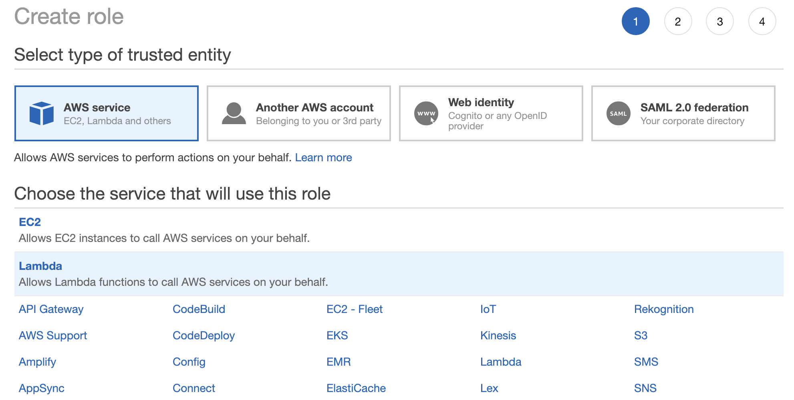
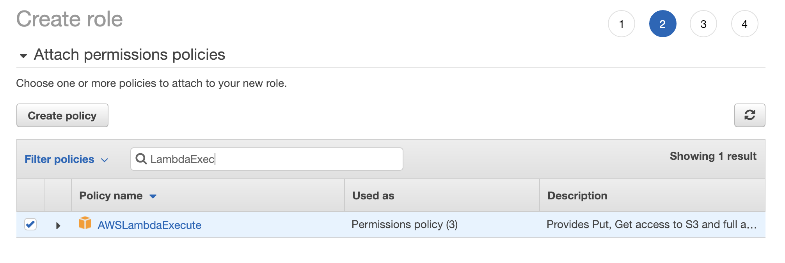

# [AWS Lambda with SAM Template to subscribe an SQS to an SNS Topic.](https://medium.com/build-succeeded/aws-lambda-with-sam-template-to-subscribe-an-sqs-to-an-sns-topic-52102b6e4bae)

Please read the blog article linked in the title above for a more detailed explanation of this code.

## Prerequisite

You must have NodeJS installed as this example uses NPM or YARN to perform the package and deploy step. If you do not wish to have node/npm|yarn installed you can run the `package` and `deploy` steps manually by taking the command line script out of the package.json file.

[Install NodeJS](https://nodejs.org/en/download/)

You must also have the SAM CLI installed for the package and deploy commands to work.

[Installing the AWS SAM CLI](https://docs.aws.amazon.com/serverless-application-model/latest/developerguide/serverless-sam-cli-install.html)

## Publish Example to your AWS

- Be sure that you have [configured your AWS credentials for your command line](https://docs.aws.amazon.com/cli/latest/userguide/cli-chap-configure.html)

- In addition, set your `AWS_DEFAULT_REGION` environment variable to match the region you wish to install the SNS, SQS, and Lambda into.  e.g. ```export AWS_DEFAULT_REGION=us-east-1```

- If you do not already have a role to allow Lambda to execute, create one now:



Be sure to choose the `Lambda` type.

Also, if you are calling other AWS Services give your role the Lamnbda Execute Permission.



Name your role and create it. Next, view the role in the console to get the ARN of your role.

- Edit the template.yaml file and replace the **Role** on line 9 with the IAM role you just created or some other valid Lambda IAM Role.

- Run the `package-deploy` command via **npm** or **yarn** to publish this example to your AWS Environment.

```
yarn package-deploy
```

-OR-

```
npm run package-deploy
```

